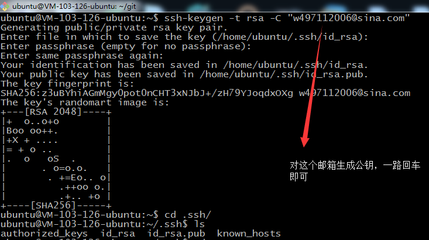

### git 使用教程

#### 生成shh公钥
- 命令：ssh-keygen -t rsa -C "youremial@xxx.xx"

（你在git bash里面执行这个命令就可以了，我的电脑上已经生成过了，就在自己的服务器生成了一下）

#### 查看生成的公钥
- 一般情况下，在window电脑上，生成的公钥都是被放在用户目录下的.ssh文件夹下，你的电脑应该就是C:/Users/huxintong/.ssh下。里面会有两个文件，一个id_ras,这个是密钥，暂时不用，另一个id_rsa.pub就是公钥，重点使用它。
    
    你可以直接使用txt将id_rsa.pub这个文件打开，在这个文件的最末尾，你可以考到你在生成公钥是的邮箱。linux下可以使用cat命令看
    

#### 在github上创建项目仓库
- 如果没有创建过项目

    
- 已经创建过项目

    

- 只填项目名就可以了

    

- 添加ssh公钥。按照下面的图进行。
        
        
        
        
        - titie里面可以随意填一个名字，在key里面添加刚刚生成的id_rsa.pub里面的内容，key输入框下面记得给自己添加写权限。

- 接下来就进入下面的这个页面了（图1，记住这个名，一会会再提到这个图）
    

    - 接着就上面图中的第二个红线了,https/ssh。建议使用ssh（这样每次提交的时候，不用输用户名和密码）
    - 然后在本地新建一个文件夹：git（随意命名）。然后右键用git bash打开。输入git init。然后输入ls -a。就能看到里面多了一个.git。这个就是git
    的本地仓库。日常使用的操作就是把我们写的代码，先提交大本地仓库，然后再把本体仓库提交到远程仓库（github）。
    
    
    - 现在看图一的大括号部分的命令。
        - git init：上面说到了，创建一个本地仓库
        - git add README.txt： 上面第一行的命令echo "# Test" >> README.md其实是创建一个README.md的文件，并向里面写入"# Test"。而 git add README.txt这个命令就是把这个文件放到一个缓冲区里面去。
        - git commit -m "first commit": 这个命令就是把刚刚提交到缓冲区的文件，放到本地的仓库去 -m 后面添加的是本次提交的备注信息。不过在这之前，你要使用 git config user.email "youremial@xxx.xx"和git config user.name "yourname"来配置你的邮箱和用户名。
        - git remote add origin git@github.com:www497112006/Test.git：现在已经把代码提交到本地的仓库，下一步就应该要把代码提交到远程仓库了，但是，提交到远程仓库前，要和远程仓库连接上。这个命令就是把本地仓库和远程仓库连接起来（这个命令会被保存到本地仓库，以后再提交就不用这个命令了）。
        - git push -u origin master：现在就可以把本地仓库的代码提交大远程的master分支上了。master是git的分支，master是主分支，可以创建其他分支，比如再创建一个dev分支，这样maste分支的代码和dev分支的代码相互之间是不影响的。
    
    
